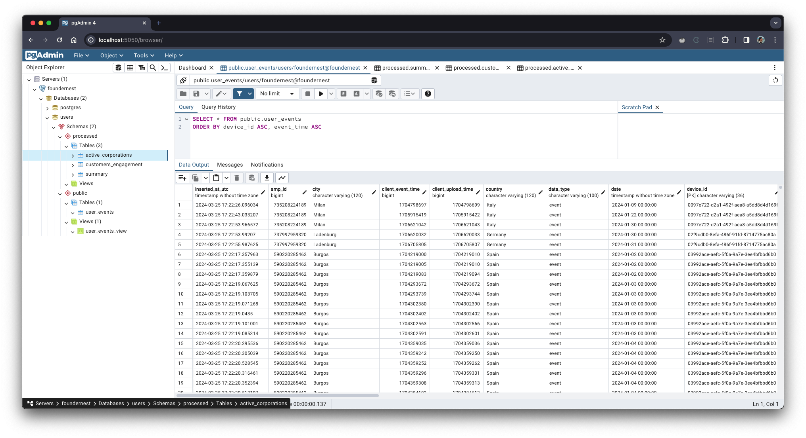
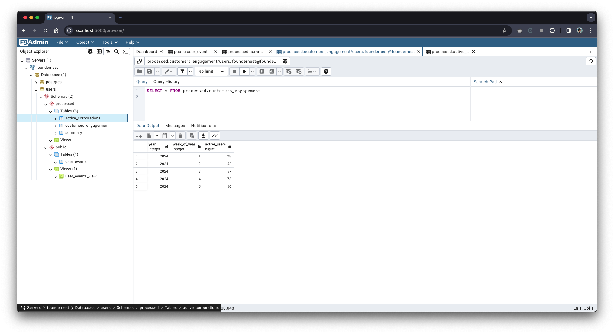
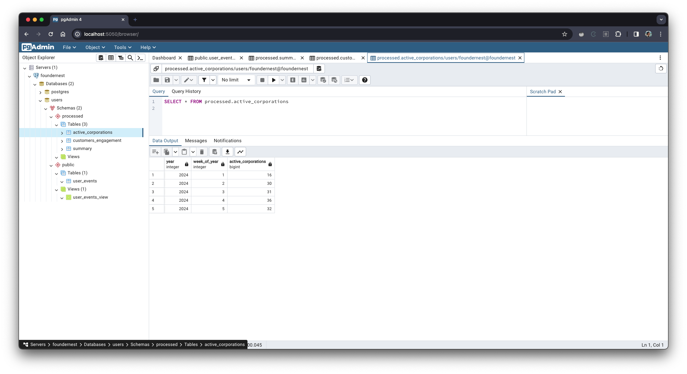
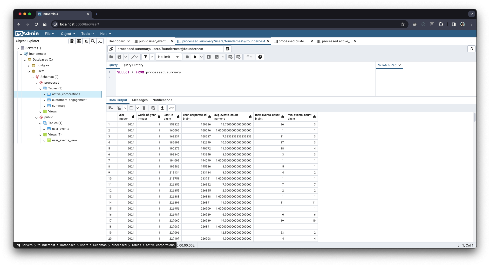

# fn-challenge

FN Junior Data Engineer challenge. Candidate: Victor Buendia.

## Table of Contents

- [fn-challenge](#fn-challenge)
  - [Table of Contents](#table-of-contents)
  - [Work timetable](#work-timetable)
  - [Overview](#overview)
    - [Tasks](#tasks)
  - [Data-related decisions](#data-related-decisions)
  - [Project considerations](#project-considerations)
  - [Usage](#usage)
  - [Requirements](#requirements)
  - [How to run](#how-to-run)
    - [Environment Variables](#environment-variables)
    - [Starting services](#starting-services)
  - [Tech Stack](#tech-stack)
  - [Code structure](#code-structure)
  - [Screenshots](#screenshots)
    - [Ingested data from API (flattened)](#ingested-data-from-api-flattened)
    - [Users engagement (per week)](#users-engagement-per-week)
    - [Active corporations per week](#active-corporations-per-week)
    - [Avg, max and min number of events per user and corporate each week](#avg-max-and-min-number-of-events-per-user-and-corporate-each-week)
  - [Final considerations](#final-considerations)

## Work timetable

The below timetable gives an estimate of time spent doing each task required to complete this challenge.

|Task|Time spent (H:MM:SS)|
|--|:--:|
| Reading challenge | 0:10:00|
| Creating [fluxogram](https://github.com/Victor-Buendia/fn-challenge/blob/main/assets/diagram.png) | 0:48:00|
| Creating [docker services](https://github.com/Victor-Buendia/fn-challenge/blob/main/docker-compose.yaml) | 0:57:00|
| Creating [DBT service docker](https://github.com/Victor-Buendia/fn-challenge/blob/44e11d1cff3c3c64d9b345b57a04f31f85470620/docker-compose.yaml#L61) | 1:01:00|
| Setting up [PgAdmin in docker services](https://github.com/Victor-Buendia/fn-challenge/blob/44e11d1cff3c3c64d9b345b57a04f31f85470620/docker-compose.yaml#L28) | 0:54:00|
| Creating python function to retrieve request data for [one day](https://github.com/Victor-Buendia/fn-challenge/blob/2798f97fc152804539defe8e3d0b3d86c30bf64f/scripts/api_handler.py#L18) and for a [whole month](https://github.com/Victor-Buendia/fn-challenge/blob/2798f97fc152804539defe8e3d0b3d86c30bf64f/scripts/api_handler.py#L33) (dates in between two dates) | 2:12:00|
| Creating [models](https://github.com/Victor-Buendia/fn-challenge/blob/main/scripts/models/user_event.py) SQL ALchemy | 1:36:00|
| Validations with [Pydantic Models](https://github.com/Victor-Buendia/fn-challenge/blob/main/scripts/validation/schemas.py) | 1:18:00|
| Creating SQL script for ["We want to measure our customers engagement, so you will need to write an SQL script that calculates weekly active users for January 2024 and saves it as a new table. An active user is any user that has an event for a given date."](https://github.com/Victor-Buendia/fn-challenge/blob/main/dbt/user_events/models/analysis/customers_engagement.sql) | 0:12:00|
| Creating SQL script for ["Each user belongs to a corporate user. Write an SQL script that can also calculate the weekly number of active corporations."](https://github.com/Victor-Buendia/fn-challenge/blob/main/dbt/user_events/models/analysis/active_corporations.sql) | 0:18:00|
| Creating SQL script for ["Finally, write an SQL script that can calculate the average, maximum and minimum number of events per user and corporate for each week in January 2024."](https://github.com/Victor-Buendia/fn-challenge/blob/main/dbt/user_events/models/analysis/summary.sql) | 0:25:00|
| Total | 9:51:00 |

## Overview


This project is intended to create a single pipeline run to extract a semi-structured data from an API and load it in a relational database as structured data. Then, it executes a few SQL operations into the data to generate insights about some aspects of it.

The diagram above illustrates in a simplified manner what happens to the data when this project is executed.

1. The data is extracted from the API through a Python script. This data comes in a semi-structured way (JSON-like). It is then converted to a dictionary in the application to execute Pydantic's data quality validations and also flatten the nested fields;
2. After that, the data is passed to SQL Alchemy as a list of dictionaries to be inserted into PostGres in a structured type;
3. Later on, dbt executes a few SQL scripts on the data stored in PostGres;
4. Finally, dbt writes the new tables generated from the SQL scripts as views or materialized tables into PostGres.

Everything service is in a Docker container and they are managed using Docker Compose.

### Tasks

In this section, main parts of the code are connected to the challenge statement, regarding what was asked in each part.

- [api_handler.py > def request_day:](https://github.com/Victor-Buendia/fn-challenge/blob/2798f97fc152804539defe8e3d0b3d86c30bf64f/scripts/api_handler.py#L18) *"Write a Python function that is capable of saving new records for a given date [...]"*
- [api_handler.py > def request_month:](https://github.com/Victor-Buendia/fn-challenge/blob/2798f97fc152804539defe8e3d0b3d86c30bf64f/scripts/api_handler.py#L33): *"[...] and a script that can recover all event data for January 2024."*
- [pgAdmin:](http://localhost:5050/browser/) *"Build a history table in a relational database for all of January 2024."*

```sql
  SELECT * FROM public.user_events ORDER BY date
```

- [customers_engagement.sql:](https://github.com/Victor-Buendia/fn-challenge/blob/main/dbt/user_events/models/analysis/customers_engagement.sql) *"We want to measure our customers engagement, so you will need to write an SQL script that calculates weekly active users for January 2024 and saves it as a new table. An active user is any user that has an event for a given date."*
- [active_corporations.sql:](https://github.com/Victor-Buendia/fn-challenge/blob/main/dbt/user_events/models/analysis/active_corporations.sql) *"Each user belongs to a corporate user. Write an SQL script that can also calculate the weekly number of active corporations."*
- [summary.sql](https://github.com/Victor-Buendia/fn-challenge/blob/main/dbt/user_events/models/analysis/summary.sql) *"Finally, write an SQL script that can calculate the average, maximum and minimum number of events per user and corporate for each week in January 2024."*

## Data-related decisions

This section explains decisions made regarding the data provided by the API and its processing in the script.

- **Data Flattening**
  - Because the consumed API has semi-structured data instead of structured, to store this data into a relational database, I flattened the data using Pydantic. This approach was made modeling a data validation class that checks and converts one record to the expected format. Then, the [dict](https://github.com/Victor-Buendia/fn-challenge/blob/44e11d1cff3c3c64d9b345b57a04f31f85470620/scripts/validation/schemas.py#L64) function makes the record a single depth level data.
  - Other approaches could have been taken, like using [JSONB](https://hashrocket.com/blog/posts/dealing-with-nested-json-objects-in-postgresql) data type for nested fields.
- **Table management with ORM**
  - Object Relational Mapping (ORM) was used in SQL Alchemy library because it maintains a consistency of the script using Python to manipulate data in the database. Using ORM also makes the code standardized, because we use methods of the library; safe, because it avoids SQL injections in data to be inserted; and tool-agnostic modelling, because it creates an abstract layer regarding the connection to PostGres, allowing a database change in the future.
- **Data quality**
  - Since data being processed has a reasonable size, Pydantic shows as a viable way of ensuring a level of data quality. It is used to coerce data to the correct data types of each field and to raise an error if a data doesn't follow a business rule.
- **Composite Primary Key**
  - To store the API data into PostGres, I've chosen `event_time` and `device_id` as a composite primary key of the `user_events` table. This decision was made thinking about a business rule where it might be very uncommon to have a single unique event to have both of the fields equal, once triggering a same event in the same id at the exact same time is a rare situation. Besides, choosing these fields as a composite primary key, we ensure that if an event has both of the fields equal to an existing field, we only update that record, instead of inserting a duplicate.
- **Active corporation concept**
  - For the SQL script in `dbt/user_events/models/analysis/active_corporations.sql`, a corporation was considered active when it had an event record and its `user_corporate_status = 'active'`.

## Project considerations

This project has four different containerized services:

```diff
+ rdbms: A postgres:16.2-alpine used as a relational database to store the data.

+ pgadmin: A pgadmin4:8.4 used to querying the stored data.

+ ingestion: A python:3.12.2 environment to run the pipeline's script and collect data
+ from the API, validate it, and insert into postgres.

+ dbt: An ubuntu:22.04 environment to execute dbt and process all the SQL scripts
+ models and saving them into postgres.
```

## Usage

This section explains the project's functioning.

## Requirements

The below requirements are necessary for running the project the way it was intended to. Their versions are also explicited, meaning that using this version of above is recommended for the a correct execution.

- GNU Make 3.81
- Docker version 25.0.4, build 1a576c50a9
- Docker Compose version 2.24.7

## How to run

### Environment Variables

For the project to run properly, it's required to create a `.env` file in the root directory. This file is automatically created when executing the pipeline using `make deploy` and can also be separately created using `make env-check`.

```.env
POSTGRES_DB=users
POSTGRES_USER=foundernest
POSTGRES_PASSWORD=password
API_TOKEN=
API_URL=
```

Notice that `API_TOKEN` and `API_URL` need to be properly defined.

### Starting services

The quickest way to start the project is executing a `make deploy` command. This will trigger an ordered pipeline with the following steps:

1. *env-check:* Asserting if a `.env` file exists. If not, create one following the already presented model.
2. *basic-services:* Starts the PostGres and PgAdmin4 in detached mode. After that, starts the Python pipeline, triggered by `scripts/main.py` executin.
3. *dbt-run:* When the ingestion of step (2) is done, starts and runs dbt to execute the SQL scripts under `dbt/user_events/models` directory.
4. *info:* Displays some useful information regarding map porting of the services.

The PgAdmin4 server can be accessed at [http://localhost:5050](http://localhost:5050).

## Tech Stack

The basic technologies used here are:

- Docker: isolate environment and dependencies from the host machine.
- Docker Compose: orchestrate the container services and their communication and volumes.
- PostGres: a relational database to store the captured data from the API.
- Dbt: data transformation tool to execute SQL scripts in our data.
- Python: programming language to execute the script.
  - SQL Alchemy: Python library to model the table and manipulate data in our database.
  - Pydantic: Python library to model data with focus on its quality.
- SQL: querying language to process data.

## Code structure

Here are the most important modules developed for this project and their objectives:

```bash
.
├── db
│   └── setup.sql                                 # Creates a "processed" schema to save dbt results
├── dbt
│   └── user_events
│       ├── models
│       │   ├── analysis
│       │   │   ├── active_corporations.sql       # Creates a table with how many corporations were active in jan. 2024
│       │   │   ├── customers_engagement.sql      # Creates a table with how many users were active in jan. 2024
│       │   │   └── summary.sql                   # Creates a table with avg, max and min number of events per user and
│       │   │                                     # corporate in jan. 2024
│       │   └── views
│                └── user_events_view.sql         
├── dbt.Dockerfile                                # Dbt environment
├── python.Dockerfile                             # Python environment
├── docker-compose.yaml                           # Docker orchestrator for the containers
├── scripts
│   ├── api_handler.py                            # Class that deals with API requests
│   ├── environment.py
│   ├── main.py
│   ├── models
│   │   └── user_event.py                         # Model of the PostGres table using SQL Alchemy
│   ├── postgres_connector.py                     # Class that connects and inserts data into PostGres
│   ├── utils.py                                  # Utility functions (date to string cast and vice-versa)
│   └── validation
│       └── schemas.py                            # Model of an event instance using Pydantic
```

## Screenshots

### Ingested data from API (flattened)



### Users engagement (per week)



### Active corporations per week



### Avg, max and min number of events per user and corporate each week



## Final considerations

- Object Relational Mapping (ORM) was used in this context assuming a high synergy between the data and product team. This is due to the modeling created for the data being ingested. It's important to ensure that the schema of the incoming data is already known by data engineering team.
- If we were to deal with an enormous amount of data (i.e. Big Data), it would be important to refactor the ingestion. Therefore, using stream in the API request; paginating the captured and processed data in a fixed batch size; changing the batch approach to a stream one; and other measures could be considered to improve performance.
- Also, in a Big Data context, data quality validation could be placed in a posterior step of the pipeline and maybe Pydantic wouldn't be the best choice performance-wise since it instantiates one object for each record.
- In a Cloud-based architecture, the services could be deployed using a Infrastructure as a Code (IaC) tool like Terraform and we could make some replacements, such as:

| Service | AWS | GCP |
|--|--|--|
| PostGres | RDS | Cloud SQL |
| Docker Compose | EKS | GKE |
| .env | KMS | Cloud KMS |
| ... |||

- It's worth emphasizing that environment variables would be saved in an AWS Parameter Store or Secrets Manager, for example in a Cloud-based architecture.
- To run the project in a regular schedule, the code could be ran using an orchestrator, like Airflow or Dagster.